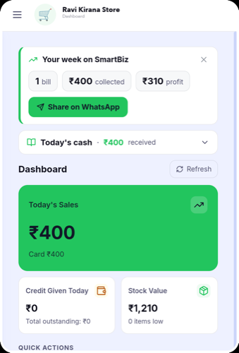
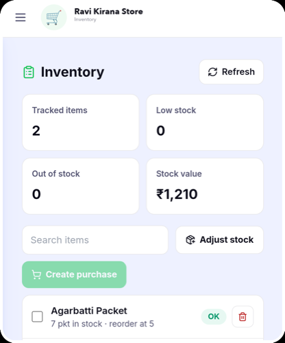

### Hi, I'm Rohith

Founder-engineer. I design, build, and operate production software solo — most recently
**SmartBiz AI**, a WhatsApp-first AI business manager that's live today with real petrol-station
customers running real money through it.

 

## What I've built

**SmartBiz AI** is two linked systems, both live in production, both closed-source (real customer
data lives in them, so the code stays private — but here's what's actually running):

- A **React/TypeScript POS and accounting web app**, deployed on Vercel, packaged for Android with
  Capacitor, and published on the Google Play Store — a real double-entry accounting core where
  every rupee is stored as integer paise, never a float.
- A companion **WhatsApp bot** (Node.js/Express) that lets a shop owner run their business by
  texting it naturally — "add 500 fuel expense," "who owes me money" — powered by a Groq-hosted
  LLM for intent parsing and Google Gemini's vision model for reading photographed bills and
  receipts. Before any AI-derived action can touch a customer's ledger, it passes through a
  two-layer guard I designed against prompt injection: a sanitizer that flags known injection
  patterns, and a strict allowlist validator that rejects anything outside a fixed schema no
  matter what the model returns.

  
  

🌐 **[smartbizai.in](https://smartbizai.in)** &nbsp;·&nbsp; 📱 Google Play _(link coming soon)_

**Also currently building:** a YOLOv8-based edge computer-vision system for petrol-station CCTV —
dataset collection and labeling, model fine-tuning, and a live-monitoring/weekly-reporting
pipeline running against real camera feeds. That repo also stays private (it contains real
security-camera footage of a live business), but it's real, running code, not a plan.

## Public code you can actually read

Since the production systems above are closed-source, here's where the same patterns show up in
the open, built from scratch with synthetic data:

- **[agentic-ledger-demo](https://github.com/rohithreddydev/agentic-ledger-demo)** — the
  prompt-injection guard architecture from the WhatsApp bot, extracted and rebuilt: LLM intent
  parsing, a strict allowlist validator, and a double-entry ledger that never trusts the model's
  raw output. MIT-licensed, 17 passing tests.
- **[doctoolkit](https://github.com/rohithreddydev/doctoolkit)** — an offline-first Android
  document toolkit (PDF/Word conversion, image tools, QR/barcode scanner). Everything runs
  on-device: no backend, no network call anywhere in the app.

## What I work with

React, TypeScript, Node.js, Postgres/Supabase, LLM-based agents (intent parsing, guardrails, tool
use), Android/Capacitor, computer vision fundamentals (YOLOv8).

🔍 Currently looking for my next role in **AI / agentic engineering**.

🔗 [LinkedIn](https://www.linkedin.com/in/rohithreddydev/) &nbsp;·&nbsp; [smartbizai.in](https://smartbizai.in)
